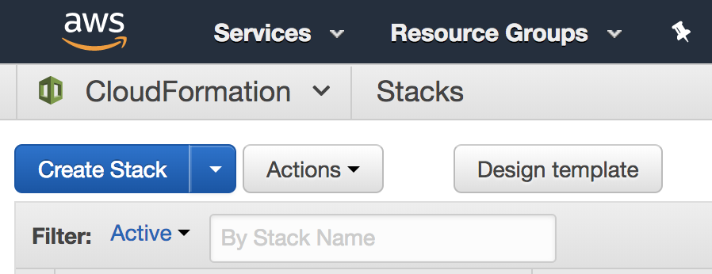
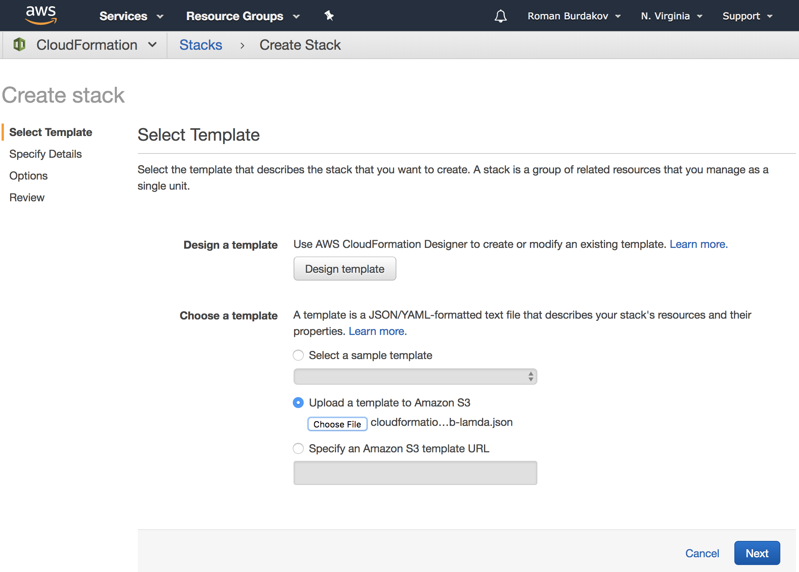
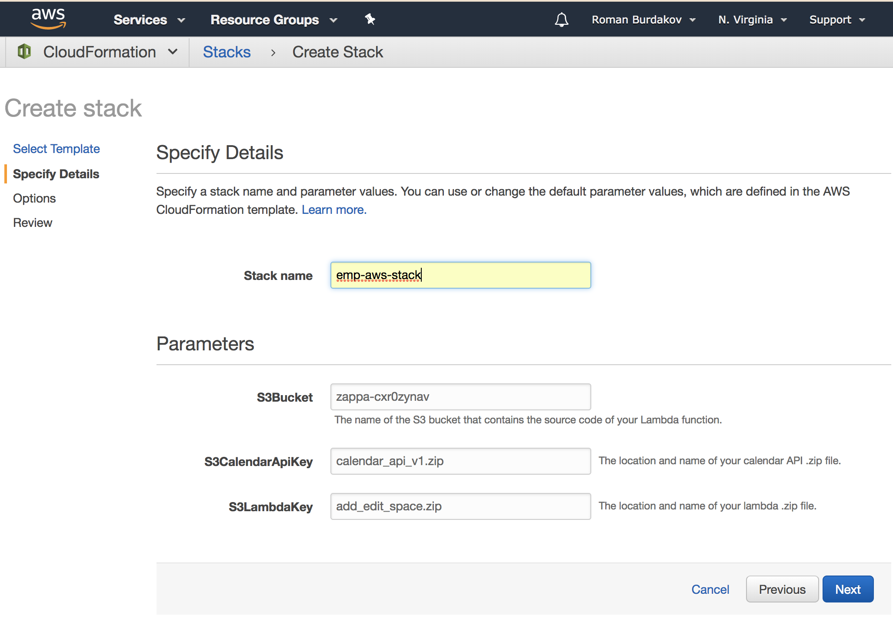
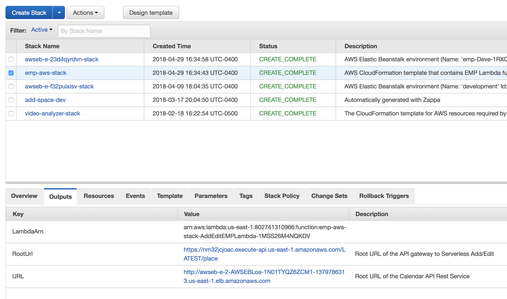
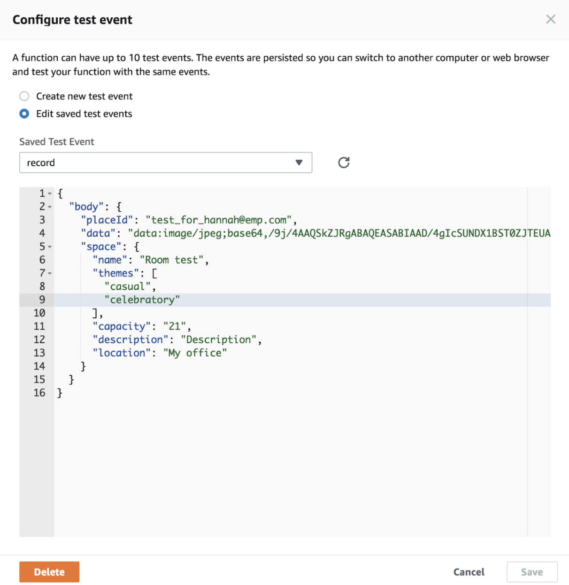
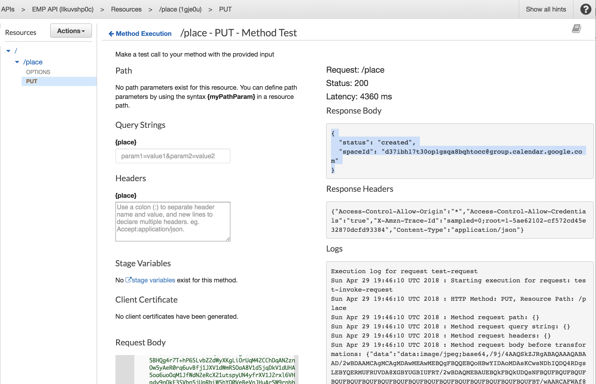

# EMP Cloud Formation Template

Enhanced meeting planner cloud formation template to provision Back End infrastructure

## Getting Started

These instructions will get you a copy of the EMP AWS Stack up and running on your personal AWS account for development and testing purposes.

### Prerequisites

A valid AWS account with basic understanding about Serverless architecture. 


### Provisioning EMP Stack in AWS

1. Package lambda function and calendar API for deployment. In order to do that, follow steps in corresponding repositories

2. Create S3 bucket and upload lambda function and calendar API app archives. Take a note of S3 bucket name and archive names

3. Navigate to `CloudFormation` Service and click *Create Stack*:

4. Chose a template by uploading a copy of `cloudformation-api-gateway-eb-lamda.json` file from this repository as demonstrated on the screenshot bellow. Click next. 

5. Give a name to EMP Stack and plugin S3 bucket name as well as archive names from step #2. Click Next

6. Skip next page since nothing should be changed there. On the last page, make sure you select `I acknowledge that AWS CloudFormation might create IAM resources.` before initiating create process.

7. It might take a couple minutes to provision all elements of the stack. Once done, 2 stacks should be added to your stack list:


8. Take a note of both urls. You will need them to run [client side](https://github.com/noorzaman/emp) code. 
Edit file `config/dev.env.js` or `config/prod.env.js` to use newly created stack:

```
  EMP_API: '"<<API_Gateway_Addr>>"',
  CALENDAR_API: '"<<CALENDAR_API_Addr>>"'
```

`API_Gateway_Addr` is the one that has `/LATEST/place` in output (2nd one on the screenshot), while `CALENDAR_API_Addr` is a url descrbied as `Root URL of the Calendar API Rest Service`

## Running the tests

### FaaS (Function as a Service) testing

Lambda function can be tested by creating test events and running them through AWS Console. 
It is similar to a unit testing and can be done by calling corresponding function with test event, however, main difference is that you can’t assert returned values. 
Have a set of valid and invalid inputs and validate them every time you need to test your changes without running full end-to-end workflow. 
In order to test lambda function with test event, we need to configure it:




You can use `add_record_lambda.json` as an example to get you started with Lambda testing. You will see result of execution including stack trace if your code had failed.

### Api Gateway testing

Api Gateway also provides ability to test methods and resources. For example, in order to test `add new meeting place` use case, we need to send request in test section of API Gateway Service and verify response:



Main difference between using tool like Postman for testing, is that API Gateway provide additional logging details about request/response transformations, which might be handy for debugging.

## Built With

* [AWS Rekognition](https://aws.amazon.com/documentation/rekognition/) - Image Recognition service from AWS
* [AWS API Gateway](https://docs.aws.amazon.com/apigateway/latest/developerguide/getting-started-with-lambda-integration.html) Lambda function integration with API Gateway 
* [AWS Elastic Beanstalk](https://aws.amazon.com/elasticbeanstalk/) - Elastic Beanstalk
* [AWS Cloud Formation](https://aws.amazon.com/cloudformation/) - Infrastructure as a code by means of AWS Cloud Formation

## Contributing

Free to use and distribute. Use it at your own risk and additional charges might apply to your account for using AWS Services.

## Acknowledgments

* Inspired by Angelo Morello for Enhanced Meeting Planner project
